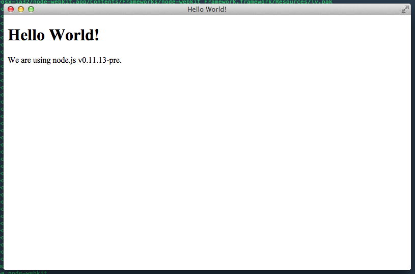

Title: Creando una app de escritorio con Node Webkit
Date: 2015-01-09 10:20
Category: Web
Tags: web, dev
Slug: first-node-webkit-app
Author: abr4xas
twitter: abr4xas
Summary: Un pequeño tutorial de como usar Node Webkit.
image: http://dribbble.s3.amazonaws.com/users/99750/screenshots/802055/nod-webkit.png

>Node-Webkit es una aplicación basada en Chromium y Node.js que te permite escribir aplicaciones nativas usando las tecnologías web

para saber más clic [aquí](https://github.com/rogerwang/node-webkit).

## La estructura de una app

Las aplicaciones de node-webkit se crean de forma similar a aplicaciones de Node, donde tenemos un directorio que contiene todos los diferentes recursos que vamos a usar en nuestra aplicación es decir, archivos HTML, CSS, JavaScript, imágenes y cualquier otro que necesitemos.

### Inicio rapido

Todas las aplicaciones deben tener un archivo llamado ```package.json```, este archivo le dice a ```node-webkit``` como abrir la aplicación y las funcionalidades de la misma.

Un ejemplo sencillo seria algo así:

Creamos un archivo HTML, ```index.html```:

```html
<!DOCTYPE html>
<html>
  <head>
    <title>Hello World!</title>
  </head>
  <body>
    <h1>Hello World!</h1>
    We are using node.js <script>document.write(process.version)</script>.
  </body>
</html>
```

Y nuestro ```package.json```:

```json
{
  "name": "nw-demo",
  "main": "index.html"
}
```

Para tener mayor información, clic [aquí](https://github.com/rogerwang/node-webkit/wiki/Manifest-format).

Para ejecutar la app solo debemos escribir en consola:

```bash
$ /path/to/nw  /path/to/app
```

Y vamos a tener una salida parecida a esta:




## Como instalar Node Webkit

La instalación esta disponible para las plataformas:

* MAC
* Linux
* Windows

Para conocer la forma de instalación adecuada a tu plataforma visita este [enlace](https://github.com/rogerwang/node-webkit#downloads).